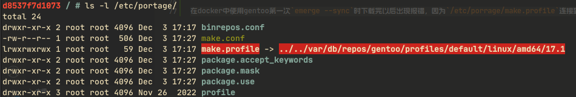

# linux相关设置

## ubuntu中文语言环境

在docker里使用ubuntu设置中文locale时可能会不存在`/etc/locale.gen`，需要安装字符集：

```sh
apt install language-pack-zh-hans
```

## systemd设置开机启动

- 系统目录结构：
    - /etc/systemd/system/：用户自定义的系统级别的unit文件目录。
    - /usr/lib/systemd/system/：软件包提供的系统级别的unit文件目录。
- 单位文件：
    - .service：定义一个服务。
    - .target：定义一个运行级别，指定了要启动的一组服务。

要在Arch Linux中创建一个新的启动项，您需要创建一个新的systemd服务，具体步骤如下：

1. 在/etc/systemd/system/目录下创建一个新的Unit文件，比如your_service.service：

    ```
    sudo touch /etc/systemd/system/your_service.service
    ```

2. 打开该文件并添加以下内容：

    ```bash
    [Unit]
    Description=Your Service
    After=network.target

    [Service]
    ExecStart=/usr/bin/your_service
    Restart=always

    [Install]
    WantedBy=multi-user.target
    ```

    其中，`Description`是描述该服务的信息，`After`表示该服务在network.target之后启动，`ExecStart`指定要运行的命令，`Restart`表示该服务在异常退出时重启，`WantedBy`指定该服务会被加入到哪个target中。

3. 启动与设置开机启动服务

    ```sh
    # 启动服务
    systemctl start your_service.service
    # 设置开机启动
    systemctl enable your_service.service
    ```


## v2ray配置文件

一些官方没有给的配置，可能需要添加ws配置：

```ini
{
    "outbounds": [
        {
            "streamSettings": {
              "network": "ws",
              "wsSettings": {
                "path": "<路径>",
                "headers": { "Host": "<Host的字符>" }
              }
            }
        }
    ]
}
```

## gentoo使用中科大源报错问题

在docker中使用中科大的源，在下载完以后报错了，查了以下论坛发现是`make.profile`的链接是一个不存在的文件，对比了以下中科大源的帮助文件，发现是`localtion`写成了`/usr/portage/`，而`make.profile`链接到了`/var/db/repos/gentoo/`。



解决办法就俩，一个是改中科大给的配置文件，一个是改`make.profile`的链接路径。俩办法选一个，别俩都整来个两极反转。

### 修改中科大配置文件

`/etc/portage/repos.conf/gentoo.conf`：

```ini
[DEFAULT]
main-repo = gentoo

[gentoo]
location = /var/db/repos/gentoo/
sync-type = rsync
sync-uri = rsync://rsync.mirrors.ustc.edu.cn/gentoo-portage/
auto-sync = yes
```

### 修改make.profile的链接路径

删除make.profile，重新链接：

```bash
rm -rf /etc/portage/make.profile
ln -s /usr/portage/profiles/default/linux/amd64/17.1 /etc/portage/make.profile
```

具体的数字和内容根据原文件修改，基本就是把`/var/db/repos/gentoo/`改成`/usr/portage/`就行了。

## lvm管理

### 创建一个lvm分区的过程

假设我们有一个`/dev/sda`的物理硬盘，现在要创建一个占用它全部空间的lvm分区。

现在`sda`上创建一个分区，即便是用整个硬盘也最好创建分区：

```bash
fdisk /dev/sda
```

分区步骤省略，假设已创建一个分区`/dev/sda1`，并且在fdisk里用t选项修改分区类型为`LVM 分区`。

创建物理卷（PV）：

```bash
pvcreate /dev/sda1
```

创建卷组（VG），卷组名叫`g0`：

```bash
vgcreate g0 /dev/sda1
```

如果有更多的PV想一次添加到VG中，只要在后面一起填上去就行。

创建逻辑卷（LV），假设创建100G大小，并且sda空间足够，卷名叫`lv1`：

```bash
lvcreate -L 100G g0 -n lv1
```

如果要用所有VG的空间来创建LV，如下：

```bash
lvcreate -l +100%FREE g0 -n lv1
```

一个lvm分区到这里就创建好了，根据具体使用进行文件系统格式化或者组成别的分区。

一些查看命令：

```bash
pvdisplay  # 查看物理卷详情
pvs        # 查看物理卷概要
vgdisplay  # 卷组用，同上
vgs
lvdisplay  # 逻辑卷用，同上
lvs
```

### 卷组（VG）扩展大小

如果卷组的空间不够了，添加新的物理硬盘来增加容量，过程如下。

根据上一节的成果，假设我们新增一块`/dev/sdb`的硬盘，先进行分区，修改分区类型：

```bash
fdisk /dev/sdb
```

创建了一个分区`/dev/sdb1`，并且修改分区类型为`LVM 分区`。

创建物理卷：

```bash
pvcreate /dev/sdb1
```

扩展卷组：

```bash
vgextend g0 /dev/sdb1
```

卷组的大小就扩展了。
