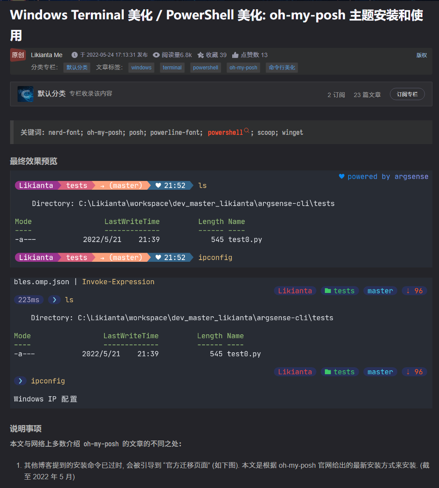
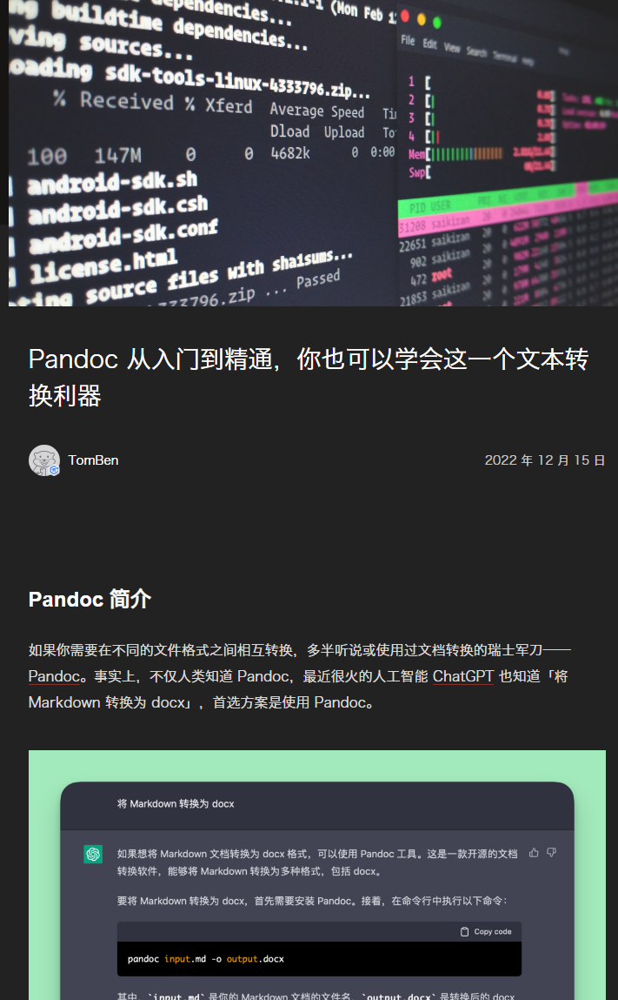
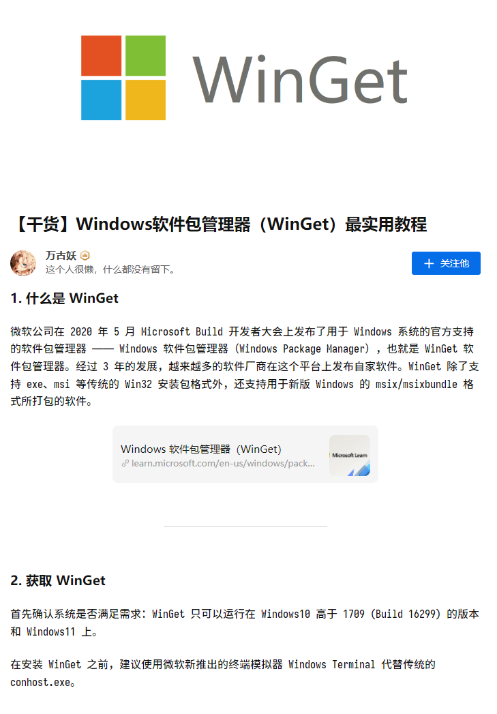
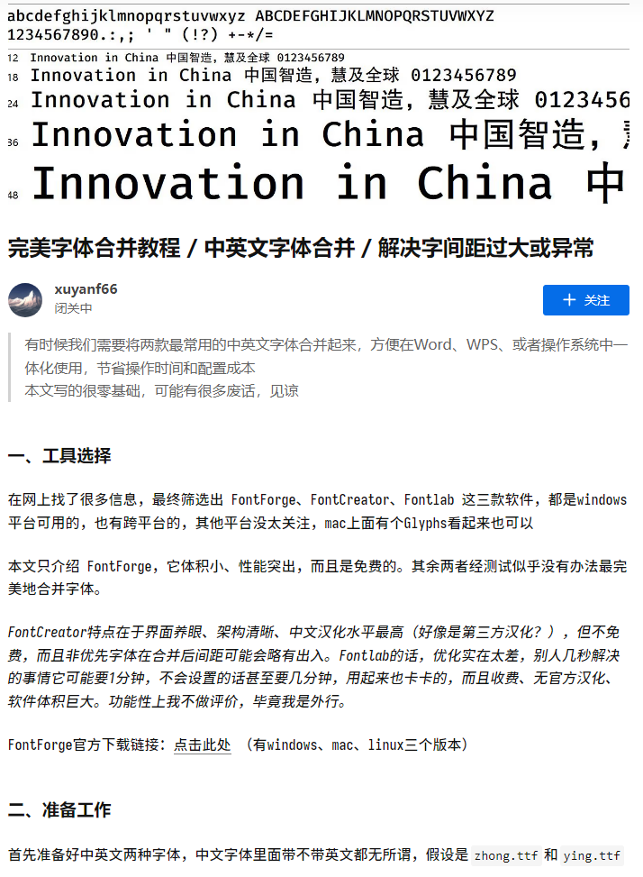

---
html:
  embed_local_images: false
  embed_svg: true
  offline: true

export_on_save:
  html: false

print_background: true
---

# 一些有用的博客

## windows下powershell美化

[博客地址](https://blog.csdn.net/likianta/article/details/124950605)

## pandoc文本转化入门

[博客地址](https://sspai.com/post/77206)

## winget教程

[博客地址](https://zhuanlan.zhihu.com/p/659515299)

## 字体合并教程

[博客地址](https://zhuanlan.zhihu.com/p/617260598)

